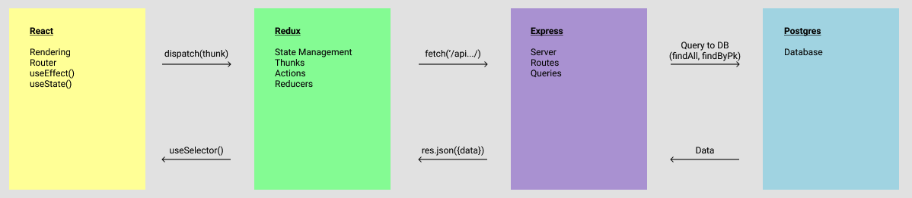

Steps to get started

1. Clone this repo

    ```url
    git clone https://github.com/mylo-james/hogwarts-aa.git && cd hogwarts-aa
    ```

2. Create a .env file in your backend and copy over the env-example file, make sure to input secret

    ```text
    PORT=5000
    DB_USERNAME=hogwarts_dev
    DB_PASSWORD=password
    DB_DATABASE=hogwarts
    DB_HOST=localhost
    JWT_SECRET=<<Insert Secret Here>>
    JWT_EXPIRES_IN=604800
    ```

3. Create a user in psql based off of the .env, give the user CREATEDB permissions

    ```bash
    psql && clear
    ```

    ```bash
    CREATE USER hogwarts_dev WITH PASSWORD 'password' CREATEDB;
    ```

    ```bash
    \q
    ```

4. Split terminals to have 3 terminals

    Run in first terminal

    ```bash
    cd backend && npm install && npm run createDB && clear && npm start
    ```

    Run in third terminal

    ```bash
    cd frontend && npm install && npm start

    ```

5. Review the app's structure

### Dataflow IMG



1. Write your initial state
2. Import useSelector from 'react-redux'
3. Initialize useSelector
4. Render information from the store
5. In the handleClick, dispatch a thunk `(TBD)`
6. Import and initialize useDispatch from 'react-redux'
7. Define a thunk to hit a backend route `(TBD)`
8. Define a backend route to query the backend
9. Dispatch an action creator `(TBD)` passing the info from the backend
10. Define the action creator with action definition `(TBD)`
11. Define the action definition
12. Write the case for the userReducer
